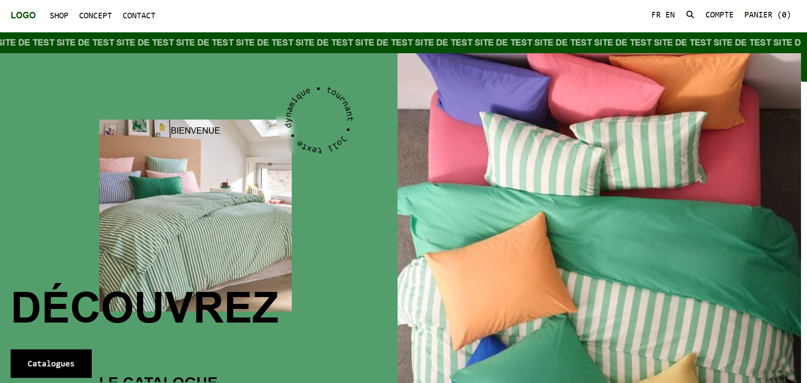

# Inspiration e-shop

## Démo Live
[Voir la démo en ligne](https://buonomolea.github.io/Inspiration-e-shop/)

## Sommaire
1. [Description du projet](#description-du-projet)
2. [Installation](#installation)
3. [Capture d'écran](#capture-décran)
4. [Contributeurs](#contributeurs)
5. [Licence](#licence)

## Description du projet
Ce projet est une reproduction d'un design d'e-shop trouvé sur Dribbble. Il présente une interface élégante et fonctionnelle pour la vente de divers produits, incluant des catégories telles que la maison, les vêtements, les accessoires, et bien plus. Le code HTML est structuré pour créer une expérience utilisateur fluide.

## Installation
Pour installer le projet, clonez le dépôt GitHub :

```bash
git clone https://github.com/BuonomoLea/Inspiration-e-shop.git
```
## Capture d'écran


## Contributeurs
Ce projet a été développé par moi-même. Si vous souhaitez l'utiliser ou l'améliorer, n'hésitez pas à le faire !

## Licence
